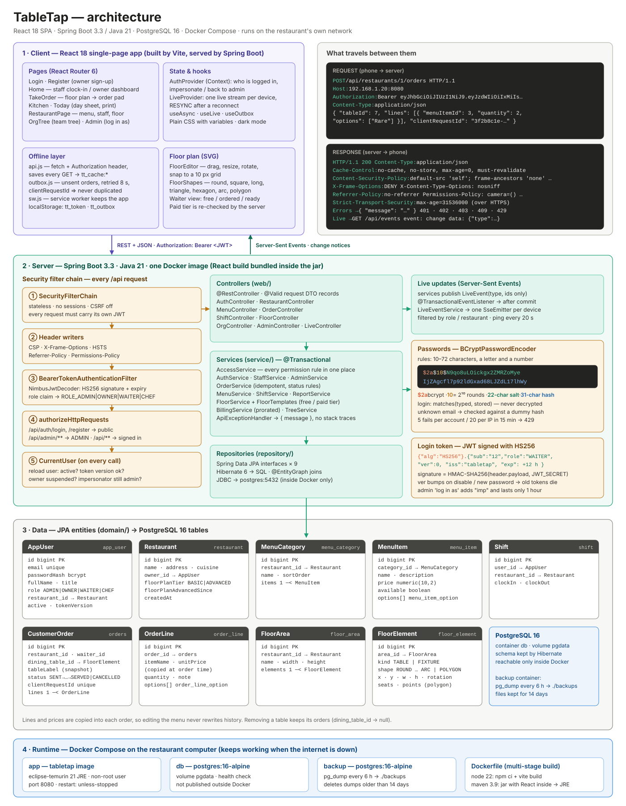

# TableTap — restaurant ordering SaaS

Spring Boot 3 (Java 21, layered) + React (Vite) + PostgreSQL. One Docker image serves both the API and the UI.



*Full-size: [docs/architecture.svg](docs/architecture.svg)*

## Run locally

```bash
docker compose up --build
```

Open http://localhost:8080 (use another port with `APP_PORT=8081 docker compose up --build`). Demo accounts (seeded when `DEMO_DATA=true`; passwords come from `.env` / compose defaults):

| Role   | Email                 | Default password |
|--------|-----------------------|------------------|
| Admin  | admin@tabletap.local  | `ChangeMe123!`   |
| Owner  | owner@demo.test       | `Password123!`   |
| Waiter | waiter@demo.test      | `Password123!`   |
| Waiter (Manager title) | manager@demo.test | `Password123!` |
| Chef   | chef@demo.test        | `Password123!`   |

Frontend hot reload: `cd frontend && npm install && npm run dev` (proxies `/api` to :8080).

## Running in a restaurant (works without internet)

TableTap runs on a computer inside the restaurant (mini PC, old laptop, Mac mini). Phones and tablets
connect to it over the restaurant's Wi-Fi, so an internet outage doesn't stop service.

```bash
./scripts/setup-local.sh      # first time: creates .env with strong secrets, starts everything, prints the address
```

- Everything restarts automatically after a power cut or reboot (`restart: unless-stopped`).
- Database backups every 6 hours to `./backups` (kept 14 days). Copy that folder somewhere safe now and then.
- **Wi-Fi blips:** phones keep the last menu/floor plan. "Send to kitchen" saves the order on the phone and
  sends it automatically when the connection returns. Each order carries a unique id so a resend is never
  duplicated. Staff see an "Offline" banner and a "waiting to send" counter.
- **The app opens even with the server off** (saved on the device by a service worker). Browsers only allow
  this over HTTPS or on `localhost`. On a plain `http://192.168.x.x` address everything above still works
  while the page stays open, but a full page reload needs the server. Next step: local HTTPS (e.g. Caddy with a
  local certificate).
- Not yet: syncing the restaurant's data up to a cloud server (for remote owner access, central billing, off-site backup).

## Architecture

```
web/          REST controllers (thin: HTTP <-> DTO)
service/      business rules + access checks (AccessService is the single source of "who can do what")
repository/   Spring Data JPA
domain/       JPA entities
dto/          request/response records
security/     JWT issue/verify, CurrentUser
config/       security, SPA fallback, seeding, typed app properties
```

**Roles** (`domain/Role.java`): `ADMIN`, `OWNER`, `WAITER`, `CHEF`. Admin ⊇ Owner ⊇ staff via `AccessService`. Chefs run the kitchen screen, update order status and mark dishes sold out, but can't take orders or edit the menu.
To add a new account type: add the enum value, then extend `AccessService` (and `SecurityConfig` if it gets its own URL space).

| Feature | Where |
|---|---|
| Owner self-signup (SaaS) | `POST /api/auth/register-owner` |
| Multiple restaurants per owner | `RestaurantService` |
| Owner adds waiters/managers | `POST /api/restaurants/{id}/staff` |
| Menu template (categories, items, options) | `MenuService` |
| No floor plan (free) | Waiters type a table number on a keypad; tables with open orders are shown as buttons. |
| Floor-plan add-on (paid, $/month) | Unlocks the designer: any number of areas, tables of any shape (round, square, long, triangle, hexagon, curved booth, hand-drawn), walls/curved walls/bar/kitchen/doors, and ready-made layouts. Waiters then tap tables on the plan. Owner accepts the price first; cancelling removes the plan. Enforced server-side (HTTP 402). `POST /api/restaurants/{id}/floor/tier`, `…/floor/template` |
| Waiter takes order → kitchen | `POST /api/restaurants/{id}/orders`, kitchen screen polls `GET …/orders?open=true` |
| Clock in / out | `/api/shifts/*` (waiters must be clocked in to send orders) |
| Org tree (owner → restaurants → staff) | `GET /api/tree` |
| Admin "log in as" owner/staff | `POST /api/admin/impersonate/{userId}` (token carries `imp` claim, audited in logs) |
| Usage billing (live) | `GET /api/billing/usage` — $/restaurant/month + floor-plan add-on $/month (both **prorated from the day added**) + $/order |
| Order history / "Today" | `GET /api/restaurants/{id}/orders/day?date=&tz=` — every order (nothing deleted), totals, items sold, per-waiter; printable day sheet |
| Live updates | `GET /api/events` (Server-Sent Events). Clock in/out, orders, menu, staff, restaurants and billing refresh on every open screen |

## Security

- Passwords: bcrypt, min 10 chars with a letter and a number; constant-time login (no email enumeration).
- Brute force: 5 failed logins per account and 20 per IP per 15 min → HTTP 429; 5 sign-ups per IP per 15 min.
- Sessions: signed JWT (HS256) re-checked against the DB on **every** request. Disabling a user, resetting a
  password or suspending an owner kills existing sessions and live streams immediately (token version).
  Suspending an owner locks out all their staff. Impersonation tokens last 1 hour and are audit-logged.
- Authorization: every endpoint goes through `AccessService` (tenant isolation: owners only see their restaurants,
  staff only their own). Waiters don't see revenue. Order status can only move forward (SENT→…→SERVED).
- Input limits on every field; errors never leak stack traces.
- Headers: strict CSP, X-Frame-Options DENY, no-referrer, Permissions-Policy, HSTS (on HTTPS).
- Production guard: with `DEMO_DATA=false` the app refuses to start with default JWT secret / admin password.
- Container runs as non-root; DB is not exposed outside Docker.

## Next steps (not built yet)
- Kitchen docket printing — listen for `ORDER_CREATED` events (print service / ESC-POS printer)
- Real billing — Stripe metered subscriptions in `BillingService`
- Flyway migrations instead of `ddl-auto: update`
- Redis for live events + rate limits if you ever run more than one app server
- httpOnly cookie sessions + refresh tokens, 2FA for owners/admins
- Option groups (e.g. "pick exactly one: Rare/Medium/Well") instead of flat multi-select options
